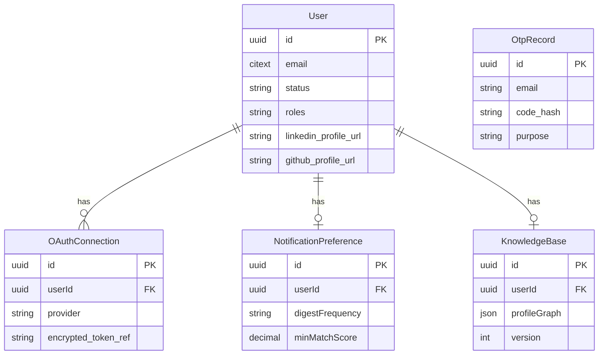

# Core Auth Service - Documentation

## Overview
The `core-auth-service` is the centralized identity and knowledge base provider for the platform. It handles user authentication (email/password, OTP, OAuth via GitHub/LinkedIn), user profile management, and stores the NLP-enriched knowledge graph of users. It also acts as the primary owner/provisioner of the shared Kafka cluster, orchestrating async flows by producing enrichment trigger events and consuming the resulting enriched profiles.

## Tech Stack
- **Language**: TypeScript (Node.js)
- **Framework**: Fastify
- **Database**: PostgreSQL (managed via Prisma ORM)
- **Cache / Rate Limiting**: Redis (`ioredis`)
- **Queue Client**: Kafka (`kafkajs`)
- **Validation**: Zod
- **Dependency Injection**: Awilix

## Folder Structure
```
core-auth-service/
├── prisma/
│   └── schema.prisma         # PostgreSQL schema definition
├── scripts/                  # DB utilities and checks
└── src/
    ├── config/               # Dependency injection (di.ts) and env loading
    ├── infrastructure/
    │   ├── db/               # Prisma client instantiation
    │   ├── email/            # SMTP integration (nodemailer)
    │   ├── messaging/        # Kafka consumer and producer implementations
    │   └── security/         # JWT, Encryption, and OTP utilities
    ├── middleware/           # Auth and error handling for Fastify routes
    ├── modules/
    │   ├── admin/            # Admin endpoints (users, stats)
    │   ├── auth/             # Sign in, Sign up, OTP, OAuth callbacks
    │   ├── knowledge-base/   # Storing and retrieving the enriched profile graph
    │   ├── notifications/    # User notification preferences
    │   └── user/             # User profile endpoints
    ├── app.ts                # Fastify app setup and plugin registration
    └── server.ts             # Entry point
```

## API Reference
*Note: All endpoints are protected by `authenticate` middleware unless related to login/signup. Some require `authorize(Admin)`.*

### Auth Module (`/api/v1/auth`)
- `POST /signup` - Registers a new user.
- `POST /signin` - Authenticates user.
- `POST /verify-otp` - Verifies email OTP.
- `POST /otp/resend` - Resends OTP.
- `POST /:provider/callback` - OAuth callback (github/linkedin).
- `POST /refresh` - Refreshes JWT token.
- `POST /password-reset/request` - Initiates password reset.
- `POST /password-reset` - Executes password reset.

### User Module (`/api/v1/users`)
- `GET /me` - Gets current user profile.
- `PUT /me` - Updates profile details.
- `DELETE /me` - Deletes user account.
- `POST /me/profile-links` - Links external profiles (e.g. GitHub URL).

### Knowledge Base Module (`/api/v1/kb`)
- `GET /` - Retrieves the user's `ProfileGraph`.
- `PUT /` - Manually updates knowledge base entries.
- `DELETE /` - Clears the knowledge base.

### Admin Module (`/api/v1/admin`)
- `GET /users`, `GET /users/:id`, `PATCH /users/:id`, `DELETE /users/:id` - User management.
- `GET /stats` - System metrics.

### Notifications Module (`/api/v1/notifications`)
- `GET /`, `PUT /`, `DELETE /` - Manage notification preferences (frequency, min match score).

## Data Model
The database is PostgreSQL managed by Prisma.



## Kafka Integration
- **Produces**: `user-kb.${eventType}` (Specifically `user-kb.ProfileEnrichmentTriggered`). 
  - **Trigger**: Occurs when a user provides new profile links or OAuth tokens.
  - **Payload Shape**: `TriggerEventEnvelope` (userId, provider, providerAccessToken, URLs).
- **Consumes**: `user-kb.ProfileEnriched`
  - **Action**: When received, updates the `KnowledgeBase` table for the corresponding `userId` with the provided `profileGraph` JSON.
- **Resilience**: The Kafka consumer uses auto-commit off and manually processes. It also programmatically attempts to create the topics on startup via the Kafka Admin client.

## Internal Flow Diagram

```mermaid
flowchart TD
    Req[Incoming HTTP Request] --> Route[Fastify Route]
    Route --> AuthMiddleware{Valid JWT?}
    AuthMiddleware -- Yes --> Controller[Controller layer]
    AuthMiddleware -- No --> ErrorHandler[Error Middleware]
    Controller --> Service[Service Layer]
    Service --> Repo[Repository (Prisma)]
    Repo --> DB[(PostgreSQL)]
    Service -.-> Publisher[KafkaProducer]
    Publisher -.-> Broker{{Kafka}}
```

## Configuration (Environment Variables)
- `NODE_ENV`: Current environment (`development`, `production`).
- `PORT`, `HOST`: Fastify bindings.
- `LOG_LEVEL`: Logging verbosity (pino).
- `DATABASE_URL`: Required. Postgres connection string.
- `REDIS_URL`: Required. Redis connection.
- `KAFKA_BROKERS`: Required. Comma-separated Kafka broker list.
- `JWT_SECRET`, `ENCRYPTION_KEY`, `OTP_SALT_SECRET`: Required security secrets.
- `GITHUB_CLIENT_ID`, `GITHUB_CLIENT_SECRET`, `GITHUB_REDIRECT_URI`: OAuth configuration.
- `LINKEDIN_CLIENT_ID`, `LINKEDIN_CLIENT_SECRET`, `LINKEDIN_REDIRECT_URI`: OAuth configuration.
- `SMTP_*`: Required for sending OTP emails.

## Error Handling & Resilience
- **Global Error Handler**: Catches Zod validation errors, Prisma database errors, and custom application errors, formatting them into standardized JSON responses.
- **Kafka Resilience**: 
  - Admin client attempts to create the topic `user-kb.ProfileEnriched` automatically on startup if it doesn't exist.
  - Graceful shutdown handlers disconnect the producer and consumer.

## Known Gaps / TODOs
- **Topic Naming Drift Risk**: The producer dynamically computes the topic name as `` user-kb.${eventType} ``. This is brittle. If `eventType` string changes, it might publish to a topic the consumer isn't listening to.
- **Consumer ConsumerGroup**: Hardcoded to `user-kb-service-consumer`, which is fine, but doesn't allow scaling out different consumer types easily without env vars.
- **DLQ**: There is no documented or implemented Dead Letter Queue for the `core-auth-service` Kafka consumer if it fails to update the DB with the enriched profile.
- **Kafka topic data on anonymous volumes (durability risk)**: The `kafka` service mounts `/var/lib/kafka/data` on an **anonymous** Docker volume (from the `confluentinc/cp-kafka` image's `VOLUME` directive), not a named volume declared in `docker-compose.yml`. A future `docker-compose up -d` that recreates the container (e.g. after a compose edit, or `up -d --force-recreate` / `-V`) could orphan or renew that volume and **lose all topics** (`job.*`, `system.dlq`, `user-kb.*`). Add a named volume (e.g. `kafka_data:/var/lib/kafka/data`) **before any deliberate full redeploy** of this container. Note: `restart: unless-stopped` was applied to the running container in-place via `docker update` (no recreation) so the reboot-recovery fix did not trigger this risk. _Deferred 2026-07-27._
