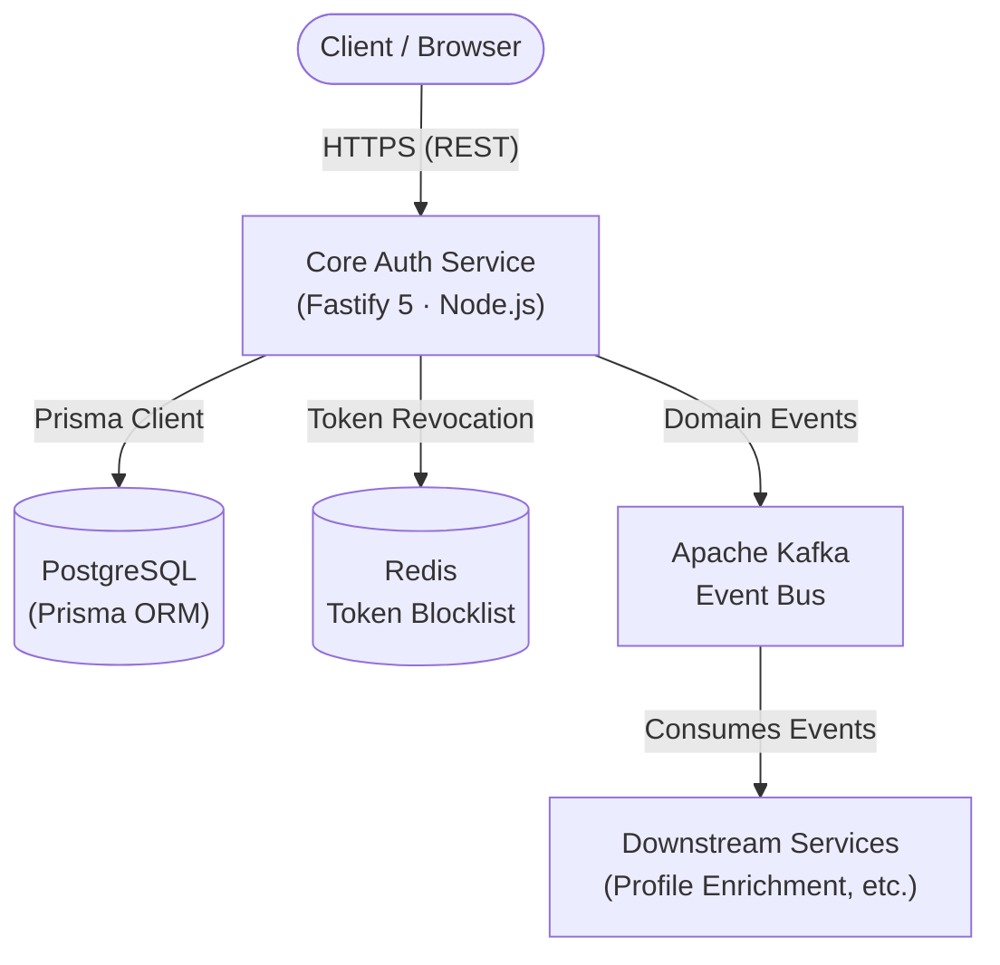
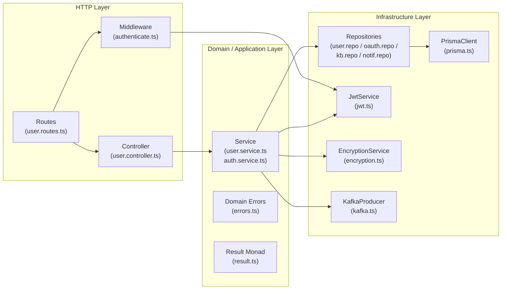
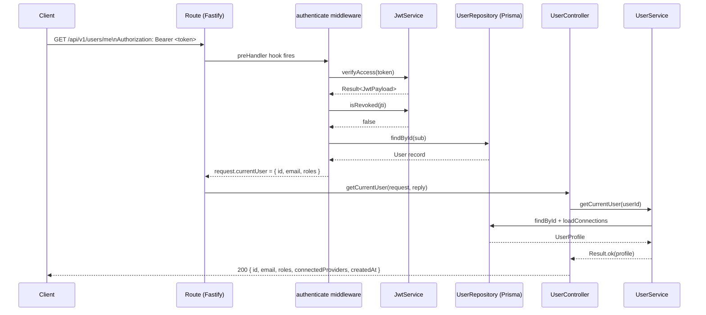
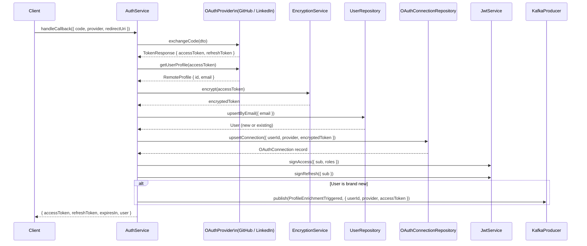
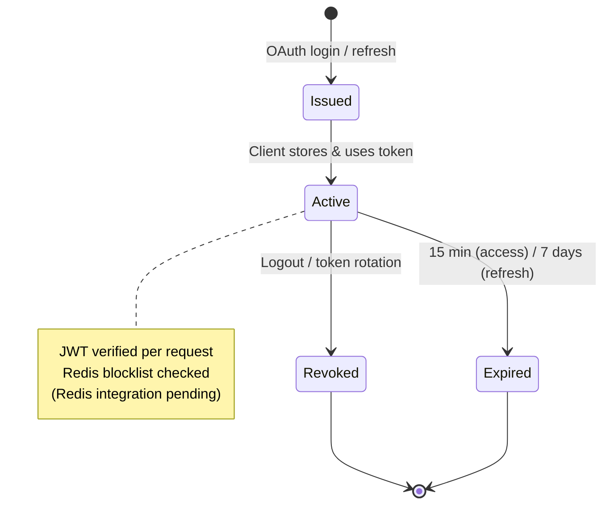
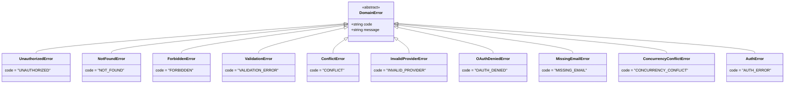

# Core Auth Service — Architecture

## Overview

The Core Auth Service is a Fastify 5 microservice responsible for:
- OAuth 2.0 authentication (GitHub, LinkedIn)
- JWT-based session management (access + refresh tokens)
- User profile management
- Emitting domain events to downstream services via Kafka

It is built following **Domain-Driven Design (DDD)** principles with a clear separation between the HTTP layer, domain logic, and infrastructure concerns.

---

## High-Level System Architecture



---

## Directory Structure

```
src/
├── app.ts                          # Fastify app factory & plugin/route registration
├── server.ts                       # Entry point — listens, handles SIGINT/SIGTERM
│
├── config/
│   ├── index.ts                    # Zod-validated environment configuration
│   └── di.ts                       # Awilix DI container setup
│
├── shared/
│   ├── result.ts                   # Result<T, E> monad (Ok / Err)
│   ├── errors.ts                   # Domain error hierarchy
│   └── logger.ts                   # Pino-based structured logger
│
├── middleware/
│   └── authenticate.ts             # JWT verification + user hydration hook
│
├── infrastructure/
│   ├── db/
│   │   └── prisma.ts               # Prisma singleton client
│   ├── security/
│   │   ├── jwt.ts                  # JWT sign/verify (access & refresh)
│   │   └── encryption.ts           # AES-256-GCM envelope encryption
│   └── messaging/
│       └── kafka.ts                # KafkaJS producer + typed event publishing
│
└── modules/
    ├── auth/
    │   ├── auth.service.ts         # OAuth callback flow, token refresh
    │   └── oauth/
    │       ├── oauth-provider.interface.ts   # IOAuthProvider contract
    │       ├── github.provider.ts            # GitHub OAuth strategy
    │       ├── linkedin.provider.ts          # LinkedIn OAuth strategy
    │       └── oauth-connection.repository.ts
    │
    ├── user/
    │   ├── user.repository.ts      # DB operations for User entity
    │   ├── user.service.ts         # Business logic: get, update, delete user
    │   ├── user.controller.ts      # HTTP request handling
    │   └── user.routes.ts          # Route definitions (GET/PUT/DELETE /users/me)
    │
    ├── knowledge-base/
    │   ├── kb.repository.ts        # DB operations for KnowledgeBase entity
    │   └── kb.service.ts           # Placeholder service
    │
    └── notifications/
        ├── notification.repository.ts
        └── notification.service.ts  # Placeholder service
```

---

## Layered Architecture



---

## Request Flow: Authenticated User Endpoint



---

## OAuth Login Flow



---

## Token Lifecycle



---

## Domain Error Hierarchy



---

## API Routes (Current)

| Method   | Path                  | Auth Required | Tag    | Description                    |
|----------|-----------------------|:-------------:|--------|--------------------------------|
| `GET`    | `/`                   | ❌            | System | Root health ping               |
| `GET`    | `/health`             | ❌            | System | Service health check           |
| `GET`    | `/docs`               | ❌            | —      | Swagger UI                     |
| `GET`    | `/api/v1/users/me`    | ✅ Bearer JWT | Users  | Get current user profile       |
| `PUT`    | `/api/v1/users/me`    | ✅ Bearer JWT | Users  | Update current user role       |
| `DELETE` | `/api/v1/users/me`    | ✅ Bearer JWT | Users  | Delete current user account    |

---

## Infrastructure Services

### JwtService (`infrastructure/security/jwt.ts`)
- **Algorithm**: HS256 (HMAC-SHA256)
- `signAccess(payload)` — expires in **15 minutes**
- `signRefresh(payload)` — expires in **7 days**
- `verifyAccess(token)` → `Result<JwtPayload>`
- `verifyRefresh(token)` → `Result<JwtPayload>`
- `isRevoked(jti)` / `revokeToken(jti)` — **TODO: Redis blocklist**

### EncryptionService (`infrastructure/security/encryption.ts`)
- **Algorithm**: AES-256-GCM (envelope encryption)
- Used to encrypt OAuth provider tokens before persistence

### KafkaProducer (`infrastructure/messaging/kafka.ts`)
- Client ID: `user-kb-service`
- Events published:
  | Event | Topic | Trigger |
  |---|---|---|
  | `ProfileEnrichmentTriggered` | `user-kb.ProfileEnrichmentTriggered` | New user created via OAuth |
  | `UserDeleted` | `user-kb.UserDeleted` | User account deleted |
  | `PreferencesUpdated` | `user-kb.PreferencesUpdated` | Notification prefs updated |

---

## Environment Configuration (`config/index.ts`)

| Variable       | Type     | Default         | Required |
|----------------|----------|-----------------|----------|
| `NODE_ENV`     | enum     | `development`   | ❌       |
| `PORT`         | number   | `8080`          | ❌       |
| `HOST`         | string   | `0.0.0.0`       | ❌       |
| `LOG_LEVEL`    | enum     | `info`          | ❌       |
| `DATABASE_URL` | URL      | —               | ✅       |
| `REDIS_URL`    | URL      | —               | ❌       |
| `KAFKA_BROKERS`| CSV list | —               | ✅       |
| `JWT_SECRET`   | string   | —               | ✅ (≥32 chars) |

---

## Dependency Injection (`config/di.ts`)

The service uses **Awilix** for IoC in `CLASSIC` (constructor injection) mode.

```mermaid
graph TD
    Container["Awilix Container"]

    Container --> Prisma["prisma (value)"]
    Container --> Logger["logger (value)"]
    Container --> Config["config (value)"]
    Container --> JwtSvc["JwtService (singleton)"]
    Container --> EncSvc["EncryptionService (singleton)"]
    Container --> KafkaProd["KafkaProducer (singleton)"]
    Container --> UserRepo["UserRepository"]
    Container --> OAuthRepo["OAuthConnectionRepository"]
    Container --> KbRepo["KnowledgeBaseRepository"]
    Container --> NotifRepo["NotificationPreferenceRepository"]
    Container --> AuthSvc["AuthService"]
    Container --> UserSvc["UserService"]
    Container --> KbSvc["KnowledgeBaseService"]
    Container --> NotifSvc["NotificationService"]
```



---

## What's Not Yet Implemented

| Item | Status |
|------|--------|
| Auth routes (`/api/v1/auth/callback`, `/api/v1/auth/refresh`) | 🔴 Pending |
| Knowledge Base routes & controller | 🔴 Pending |
| Notifications routes & controller | 🔴 Pending |
| Redis token blocklist (`isRevoked` / `revokeToken`) | 🔴 Pending |
| `authorize.ts` — Role-based access control middleware | 🔴 Pending |
| `error-handler.ts` — Global error serialization plugin | 🔴 Pending |
| Unit & integration tests | 🔴 Pending |
