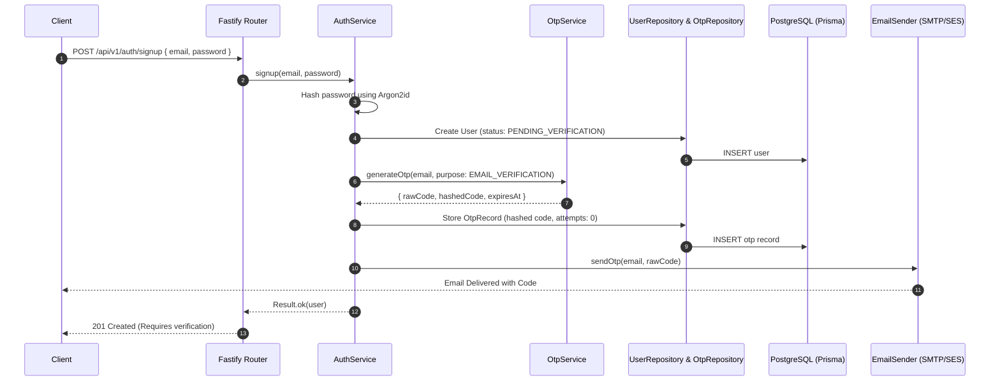

# Implementation Plan: Production-Grade Email/Password with Email OTP Authentication

This document outlines the detailed architectural changes, security strategies, database updates, API contracts, and file-by-file implementation plan for adding production-grade Email/Password login and Sign-Up verification with Email-based One-Time Passwords (OTP).

---

## 1. Architectural Overview & Security Design

To deliver a production-grade, secure authentication system, the architecture will adhere to Domain-Driven Design (DDD) principles and implement industry-standard security practices.



### Key Security Policies

1. **Password Hashing (Argon2id)**:
   - Passwords will be hashed using Argon2id via the `argon2` npm library.
   - Recommended parameters for production:
     - Memory: 65,536 KB (64 MB)
     - Iterations: 3
     - Parallelism: 4
2. **OTP Generation & Verification**:
   - OTPs will be cryptographically secure 6-digit numeric strings generated using Node's `crypto.randomInt`.
   - **Hashed Storage**: To prevent token leakage in case of database compromises, OTPs are hashed using SHA-256 with a salt before persisting to the database.
   - **Expiration**: OTPs will expire after 10 minutes.
   - **Brute Force Protection**: Maximum of 3 verification attempts per OTP code. Once exceeded, the OTP is deleted, requiring a new code request.
   - **Single Use**: Upon successful verification, the OTP is immediately deleted.
3. **Throttling & Rate Limiting**:
   - Limit OTP generation requests per email (e.g., maximum 1 request per 60 seconds).
   - Global endpoint rate-limiting via Fastify rate-limiter (e.g., 5 registration/login requests per minute per IP).

---

## 2. Database Schema Updates (`prisma/schema.prisma`)

We will modify the `User` model to support passwords, verification status, and introduce a new `Otp` model.

```prisma
// ── Enums ───────────────────────────────────────────────────────────────────

enum UserStatus {
  PENDING_VERIFICATION
  ACTIVE
  SUSPENDED
}

enum OtpPurpose {
  EMAIL_VERIFICATION
  PASSWORD_RESET
  MFA
}

// ── User ────────────────────────────────────────────────────────────────────

model User {
  id           String     @id @default(uuid()) @db.Uuid
  email        String     @unique @db.Citext
  passwordHash String?    @map("password_hash") // Optional to support pure OAuth users
  status       UserStatus @default(PENDING_VERIFICATION)
  roles        UserRole   @default(CANDIDATE)
  createdAt    DateTime   @default(now()) @map("created_at")
  updatedAt    DateTime   @updatedAt @map("updated_at")

  // Relations
  oauthConnections  OAuthConnection[]
  notificationPrefs NotificationPreference?
  knowledgeBase     KnowledgeBase?

  @@map("users")
}

// ── OTP Record ──────────────────────────────────────────────────────────────

model OtpRecord {
  id        String     @id @default(uuid()) @db.Uuid
  email     String     @db.Citext
  codeHash  String     @map("code_hash")
  purpose   OtpPurpose
  attempts  Int        @default(0)
  expiresAt DateTime   @map("expires_at")
  createdAt DateTime   @default(now()) @map("created_at")
  updatedAt DateTime   @updatedAt @map("updated_at")

  @@index([email, purpose])
  @@map("otp_records")
}
```

---

## 3. Directory and File Layout

We will add new services under `src/infrastructure` and extend the existing `auth` and `user` modules:

```
src/
├── infrastructure/
│   ├── security/
│   │   ├── hash.ts                 # New: Hashing Service (Argon2id)
│   │   └── otp.ts                  # New: Cryptographic OTP generator/verifier
│   └── email/
│       └── email.service.ts        # New: Email Service (SMTP/SendGrid/SES)
│
└── modules/
    ├── auth/
    │   ├── auth.service.ts         # Modified: Handle email/password signup, signin, verify
    │   ├── auth.controller.ts      # Modified: Fastify controller for new auth endpoints
    │   ├── auth.routes.ts          # Modified: Schema validator & routes (signup, signin, verify)
    │   └── otp/
    │       └── otp.repository.ts   # New: Database operations for OTP records
    └── user/
        └── user.repository.ts      # Modified: Support passwordHash and status fields
```

---

## 4. Detailed Component Implementation Details

### 4.1. Hashing Service ([hash.ts](file:///home/theplator/Desktop/core-auth-service/src/infrastructure/security/hash.ts))

Encapsulates password hashing and verification.

```typescript
import argon2 from 'argon2';
import { Result } from '../../shared/result.js';

export class HashService {
  async hash(password: string): Promise<Result<string, Error>> {
    try {
      const hashed = await argon2.hash(password, {
        type: argon2.argon2id,
        memoryCost: 65536,
        timeCost: 3,
        parallelism: 4,
      });
      return Result.ok(hashed);
    } catch (error) {
      return Result.err(error as Error);
    }
  }

  async verify(password: string, hash: string): Promise<Result<boolean, Error>> {
    try {
      const isValid = await argon2.verify(hash, password);
      return Result.ok(isValid);
    } catch (error) {
      return Result.err(error as Error);
    }
  }
}
```

### 4.2. OTP Service ([otp.ts](file:///home/theplator/Desktop/core-auth-service/src/infrastructure/security/otp.ts))

Generates secure 6-digit numeric OTPs and handles cryptographic hashing using `crypto`.

```typescript
import crypto from 'crypto';
import { Result } from '../../shared/result.js';

export interface GeneratedOtp {
  code: string;       // Plaintext (to be sent via email)
  codeHash: string;   // Hashed version (to be saved in DB)
  expiresAt: Date;
}

export class OtpService {
  private readonly EXPIRY_MINUTES = 10;
  private readonly SALT_SECRET = process.env.OTP_SALT_SECRET ?? 'fallback-otp-salt';

  generate(email: string): GeneratedOtp {
    const code = crypto.randomInt(100000, 999999).toString();
    const expiresAt = new Date();
    expiresAt.setMinutes(expiresAt.getMinutes() + this.EXPIRY_MINUTES);

    const codeHash = this.hashOtp(code, email);

    return { code, codeHash, expiresAt };
  }

  hashOtp(code: string, email: string): string {
    return crypto
      .createHmac('sha256', this.SALT_SECRET)
      .update(`${code}:${email}`)
      .digest('hex');
  }
}
```

### 4.3. Email Service ([email.service.ts](file:///home/theplator/Desktop/core-auth-service/src/infrastructure/email/email.service.ts))

Responsible for sending emails. Defines an interface for high extensibility (DDD port & adapter style).

```typescript
import { Result } from '../../shared/result.js';
import pino from 'pino';

export interface IEmailSender {
  sendVerificationEmail(email: string, code: string): Promise<Result<void, Error>>;
  sendPasswordResetEmail(email: string, code: string): Promise<Result<void, Error>>;
}

export class ConsoleEmailSender implements IEmailSender {
  constructor(private readonly logger: pino.Logger) {}

  async sendVerificationEmail(email: string, code: string): Promise<Result<void, Error>> {
    this.logger.info({ email, code }, '📧 [EMAIL VERIFICATION OTP] SENT');
    return Result.ok(undefined);
  }

  async sendPasswordResetEmail(email: string, code: string): Promise<Result<void, Error>> {
    this.logger.info({ email, code }, '📧 [PASSWORD RESET OTP] SENT');
    return Result.ok(undefined);
  }
}
```

### 4.4. OTP Repository ([otp.repository.ts](file:///home/theplator/Desktop/core-auth-service/src/modules/auth/otp/otp.repository.ts))

Interacts with the database for transaction safety and retrieval.

```typescript
import { PrismaClient, OtpRecord, OtpPurpose } from '@prisma/client';
import { Result } from '../../../shared/result.js';

export class OtpRepository {
  constructor(private readonly prisma: PrismaClient) {}

  async save(data: {
    email: string;
    codeHash: string;
    purpose: OtpPurpose;
    expiresAt: Date;
  }): Promise<Result<OtpRecord, Error>> {
    try {
      // Invalidate existing OTPs for the same email + purpose first
      await this.prisma.otpRecord.deleteMany({
        where: { email: data.email, purpose: data.purpose },
      });

      const record = await this.prisma.otpRecord.create({ data });
      return Result.ok(record);
    } catch (error) {
      return Result.err(error as Error);
    }
  }

  async findActive(email: string, purpose: OtpPurpose): Promise<Result<OtpRecord | null, Error>> {
    try {
      const record = await this.prisma.otpRecord.findFirst({
        where: {
          email,
          purpose,
          expiresAt: { gt: new Date() },
        },
      });
      return Result.ok(record);
    } catch (error) {
      return Result.err(error as Error);
    }
  }

  async incrementAttempts(id: string): Promise<Result<OtpRecord, Error>> {
    try {
      const record = await this.prisma.otpRecord.update({
        where: { id },
        data: { attempts: { increment: 1 } },
      });
      return Result.ok(record);
    } catch (error) {
      return Result.err(error as Error);
    }
  }

  async delete(id: string): Promise<Result<void, Error>> {
    try {
      await this.prisma.otpRecord.delete({ where: { id } });
      return Result.ok(undefined);
    } catch (error) {
      return Result.err(error as Error);
    }
  }
}
```

### 4.5. Domain Error Extensions (`src/shared/errors.ts`)

Introduce distinct error classes for detailed API responses and user status handling:

```typescript
export class UserNotVerifiedError extends DomainError {
  constructor(message = 'User email is not verified') {
    super(message, 'EMAIL_NOT_VERIFIED');
  }
}

export class InvalidCredentialsError extends DomainError {
  constructor(message = 'Invalid email or password') {
    super(message, 'INVALID_CREDENTIALS');
  }
}

export class InvalidOtpError extends DomainError {
  constructor(message = 'Invalid or expired OTP') {
    super(message, 'INVALID_OTP');
  }
}

export class MaxOtpAttemptsExceededError extends DomainError {
  constructor(message = 'Too many failed verification attempts. Please request a new OTP.') {
    super(message, 'MAX_OTP_ATTEMPTS_EXCEEDED');
  }
}

export class OtpCooldownError extends DomainError {
  constructor(message = 'Please wait before requesting a new OTP.') {
    super(message, 'OTP_COOLDOWN');
  }
}
```

---

## 5. API Routes & Schema Contracts

### 5.1. User Sign-Up
- **Method / Path**: `POST /api/v1/auth/signup`
- **Request Body**:
  ```json
  {
    "email": "user@example.com",
    "password": "Password123!"
  }
  ```
- **Response**:
  - `201 Created`:
    ```json
    {
      "message": "User registered successfully. Verification code sent to email.",
      "email": "user@example.com"
    }
    ```
  - `409 Conflict`: User already exists.

### 5.2. OTP Verification
- **Method / Path**: `POST /api/v1/auth/verify-otp`
- **Request Body**:
  ```json
  {
    "email": "user@example.com",
    "code": "123456",
    "purpose": "EMAIL_VERIFICATION"
  }
  ```
- **Response**:
  - `200 OK`:
    ```json
    {
      "accessToken": "eyJhb...",
      "refreshToken": "eyJhb...",
      "expiresIn": 900,
      "user": {
        "id": "uuid",
        "email": "user@example.com",
        "roles": ["CANDIDATE"]
      }
    }
    ```
  - `400 Bad Request`: OTP incorrect, expired, or max attempts exceeded.

### 5.3. User Sign-In
- **Method / Path**: `POST /api/v1/auth/signin`
- **Request Body**:
  ```json
  {
    "email": "user@example.com",
    "password": "Password123!"
  }
  ```
- **Response**:
  - `200 OK`: Returns access + refresh tokens and user profile if status is `ACTIVE`.
  - `403 Forbidden`: Credentials correct but email is not verified (`EMAIL_NOT_VERIFIED`). Includes code to prompt UI to show verify screen.
  - `401 Unauthorized`: Invalid credentials.

### 5.4. Resend OTP
- **Method / Path**: `POST /api/v1/auth/otp/resend`
- **Request Body**:
  ```json
  {
    "email": "user@example.com",
    "purpose": "EMAIL_VERIFICATION"
  }
  ```
- **Response**:
  - `200 OK`:
    ```json
    { "message": "Verification code resent." }
    ```
  - `429 Too Many Requests`: If OTP cooldown (e.g. 60s) has not expired.

---

## 6. Phase-by-Phase Implementation Plan

### Phase 1: Database Migration
1. Add `UserStatus` and `OtpPurpose` enums to `prisma/schema.prisma`.
2. Add `passwordHash` and `status` fields to the `User` model.
3. Define the `OtpRecord` model.
4. Run `npx prisma migrate dev --name add_email_password_otp`.

### Phase 2: Infrastructure Layer
1. Add Hashing service `src/infrastructure/security/hash.ts` wrapping `argon2`.
2. Add Cryptographic OTP generator/verifier `src/infrastructure/security/otp.ts`.
3. Add Email sender abstraction and Console implementation `src/infrastructure/email/email.service.ts`.
4. Register the new services (`hashService`, `otpService`, `emailSender`) as singletons in `src/config/di.ts`.

### Phase 3: Domain & Repositories
1. Add OTP repository `src/modules/auth/otp/otp.repository.ts`. Register in `src/config/di.ts`.
2. Update `UserRepository` (`src/modules/user/user.repository.ts`):
   - Modify `upsertByEmail` to support optional password hashes.
   - Add a `createWithPassword` method.
   - Update user schema interfaces.
3. Update `src/shared/errors.ts` to include OTP/Credential domain errors.

### Phase 4: Business Logic Layer (`AuthService`)
Update `src/modules/auth/auth.service.ts` to include:
1. `signup(email, password)`: Hashes password, saves user with status `PENDING_VERIFICATION`, generates/persists OTP, fires verification email, emits Kafka event.
2. `verifyOtp(email, code, purpose)`: Validates code (checking expiration and hashing), handles attempt tracking, updates user status to `ACTIVE` upon success, issues tokens.
3. `signin(email, password)`: Validates credentials, checks user status. If `PENDING_VERIFICATION`, returns error monad containing `UserNotVerifiedError`.
4. `resendOtp(email, purpose)`: Enforces 60-second cooldown, generates a new OTP, persists, and emails it.

### Phase 5: Fastify Route & Controller Registration
1. In `src/modules/auth/auth.controller.ts`, add methods mapping to endpoints.
2. In `src/modules/auth/auth.routes.ts`, write Zod validation schemas for all requests and register routes.
3. Register new dependencies in manual wiring section of `src/app.ts`.

### Phase 6: Testing & Quality Assurance
1. Write unit tests for `HashService`, `OtpService`, and `AuthService` using Vitest.
2. Write integration tests using Supertest/Fastify injection to test the complete Signup -> Verify -> Signin lifecycle.
